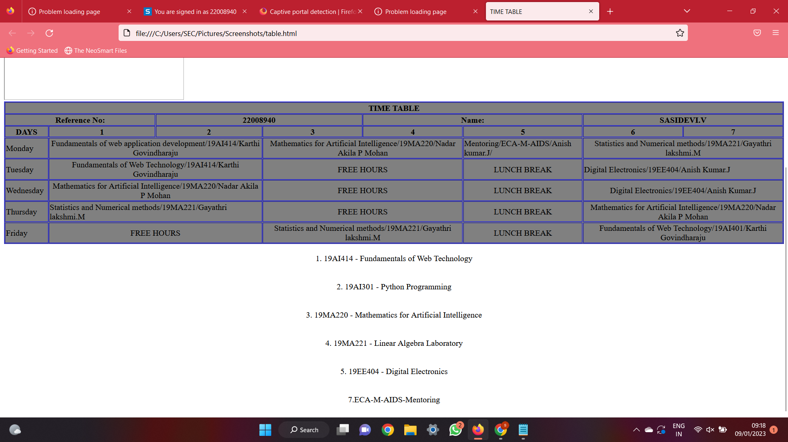

# Experiment_Time_Table

## AIM
To Write a html webpage page to display your timetable.

# ALGORITHM
### STEP 1
create a simple table using table tag
### STEP 2
Add header row using th tag
### STEP 3
Add your timetable
### STEP 4
Execute the program

# CODE:
```
<!DOCTYPE html>
<html>

   <head>
      <title>TIME TABLE</title>
   </head>

   <body>
	</img>
      <table border = "1" cellspacing="1" bordercolor="blue" bgcolor="grey">
         <tr>
	     	
            <th colspan="8">TIME TABLE</th>

         </tr>
	<tr>
		<th colspan="2">Reference No:</th>
        	<th colspan="2">22008940</th>
		<th colspan="2">Name:</th>
		<th colspan="2">SASIDEVI.V</th>
	</tr>
         <tr>
            <th>DAYS</th>
            <th>1</th>
            <th>2</th>
            <th>3</th>
            <th>4</th>
            <th>5</th>
            <th>6</th>
            <th>7</th>
           
         </tr>
       
 
  <tr>
             <td>Monday</td>
             <td colspan="2"><center>Fundamentals of web application development/19AI414/Karthi Govindharaju</center></td>
             <td colspan="2"><center>Mathematics for Artificial Intelligence/19MA220/Nadar Akila P Mohan</center></td>
             <td><centre>Mentoring/ECA-M-AIDS/Anish kumar.J/</centre></td>
             <td colspan="2"><center>Statistics and Numerical methods/19MA221/Gayathri lakshmi.M</center></td>
</tr>
<tr>
             <td>Tuesday</td>
             <td colspan="2"><center>Fundamentals of Web Technology/19AI414/Karthi Govindharaju</center></td>
             <td colspan="2"><center>FREE HOURS</center></td></center>
             <td><center>LUNCH BREAK</center></td>
             <td colspan="2"><centre>Digital Electronics/19EE404/Anish Kumar.J</center></td>
</tr>
<tr>
             <td>Wednesday</td>
             <td colspan="2"><center>Mathematics for Artificial Intelligence/19MA220/Nadar Akila P Mohan</center></td>
             <td colspan="2"><center>FREE HOURS</centre></td>
             <td><center>LUNCH BREAK</center></td>
             <td colspan="2"><center>Digital Electronics/19EE404/Anish Kumar.J</center></td>
</tr>
  <tr>
             <td>Thursday</td>
             <td colspan="2"<center>Statistics and Numerical methods/19MA221/Gayathri lakshmi.M</center></td>
             <td colspan="2"><center>FREE HOURS</center></td>
             <td><center>LUNCH BREAK</center></td>
             <td colspan="2"><center>Mathematics for Artificial Intelligence/19MA220/Nadar Akila P Mohan</center></td></center>
</tr>
<tr>
             <td>Friday</td>
             <td colspan="2"><center>FREE HOURS</center></td>
             <td colspan="2"><center>Statistics and Numerical methods/19MA221/Gayathri lakshmi.M</center></td>
             <td><center>LUNCH BREAK</center></td>
             <td colspan="2"><center>Fundamentals of Web Technology/19AI401/Karthi Govindharaju</center></td>
</tr>

 
        
      </table>
    <br><center>1. 19AI414 - Fundamentals of Web Technology</center></br>
    <br><center>2. 19AI301 - Python Programming</center></br>
    <br><center>3. 19MA220 - Mathematics for Artificial Intelligence</center></br>
    <br><center>4. 19MA221 - Linear Algebra Laboratory</center></br>
    <br><center>5. 19EE404 - Digital Electronics</center></br>
    <br><center>7.ECA-M-AIDS-Mentoring</center></br>

      
     
   </body>
</html
```

# OUPUT:

